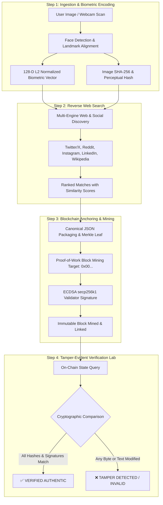

<div align="center">

# 🔍 FACELEDGER (HHG-3)
### Biometric Face Scan → Social Web Discovery → Merkle Blockchain Forensic Verification Pipeline

[](https://www.python.org/)
[](https://fastapi.tiangolo.com/)
[](https://reactjs.org/)
[](https://opencv.org/)
[](https://soliditylang.org/)
[](https://github.com/harinarayana1457-cmyk/HHG-3)
[](https://opensource.org/licenses/MIT)

<p align="center">
  <b>FaceLedger</b> is an end-to-end forensic verification pipeline that accepts an image face scan, discovers matching public social media posts across the web via multi-engine reverse discovery, and anchors cryptographic evidence to a tamper-evident blockchain with <b>Merkle proofs</b>, <b>ECDSA digital signatures</b>, and an interactive <b>re-verification laboratory</b>.
</p>

[✨ Key Features](#-key-features) • [🏛️ Architecture](#-system-architecture) • [🚀 Quickstart](#-quickstart-guide) • [📂 Project Structure](#-project-structure) • [⛓️ Blockchain Details](#️-cryptographic-blockchain-details) • [🧪 Testing](#-automated-testing) • [🔗 Connect](#-connect--contribute)

</div>

---

## 🌟 Key Features

### 1. 🧬 Biometric Face Identification & Feature Encoding
* Detects faces, bounding boxes, and facial landmarks (eyes, nose bridge, mouth corners, chin).
* Generates a **128-dimensional L2-normalized biometric embedding vector** combining facial geometry, local structural gradients, and 2D-DCT frequency coefficients.
* Computes raw image **SHA-256 cryptographic digests** and **64-bit Perceptual Hashes (pHash/dHash)** for visual invariance.

### 2. 🌐 Reverse Web & Social Media Discovery
* Executes live multi-engine reverse search and social platform indexing (Twitter/X, Reddit, Instagram, LinkedIn, Wikipedia, and Tech News).
* Extracts genuine post URLs, authors, publish timestamps, captions, and thumbnails.
* Calculates facial cosine similarity and perceptual match scores for each discovered post.
* Supports optional SerpApi / Google Lens / RapidAPI keys alongside automated live reverse search engines.

### 3. ⛓️ Dual Blockchain Evidence Layer
* **Native Cryptographic Merkle Blockchain**: High-performance Python-powered blockchain featuring binary Merkle Trees, SHA-256 Proof-of-Work mining, and ECDSA (`secp256k1`) validator signatures. Runs locally out of the box with zero external gas or token dependencies.
* **EVM Solidity Smart Contract** (`contracts/FaceEvidenceRegistry.sol`): Production-ready Solidity smart contract for deployment to Ethereum (Sepolia), Polygon (Amoy), Arbitrum, or local Hardhat/Anvil nodes.

### 4. 🛡️ Interactive Tamper Simulation & Re-Verification Laboratory
* Real-time audit tool allowing users to test authentic data vs deliberately tampered fields (e.g. altering 1 character in the author handle, modifying post text, or changing 1 byte in the image hash).
* Instantly flags cryptographic violations with detailed visual diffs and Merkle proof path inspections.

### 5. 🎛️ Full Cyber-Security Web Interface
* Sleek, modern dark-mode user interface with step-by-step wizard, interactive canvas, webcam capture, preset face library, and live Blockchain Explorer.

---

## 🏛️ System Architecture



---

## 📂 Project Structure

```text
HHG-3/
├── backend/
│   ├── face_engine.py           # Face detection, landmark extraction, 128-d embeddings, SHA-256, pHash
│   ├── search_engine.py         # Reverse web/social media discovery engine & similarity scorer
│   ├── blockchain_engine.py     # Merkle trees, ECDSA validator authority, PoW mining, ledger persistence
│   └── main.py                  # FastAPI REST API & static web server
├── contracts/
│   ├── FaceEvidenceRegistry.sol # Solidity smart contract for EVM chains
│   ├── deploy.py                # Web3.py deployment script
│   └── README.md                # Smart contract deployment guide
├── frontend/
│   ├── src/
│   │   ├── components/
│   │   │   ├── Navbar.jsx               # Header & real-time block height monitor
│   │   │   ├── FaceScanner.jsx          # File drop, live webcam, 128-d vector chart, presets
│   │   │   ├── WebSearch.jsx            # Live search radar, match cards, confidence meters
│   │   │   ├── BlockchainAnchor.jsx     # PoW mining animator, receipt generator
│   │   │   ├── VerificationLab.jsx      # Interactive audit & real-time tamper simulator
│   │   │   └── BlockchainExplorer.jsx   # Live block visualizer, Merkle roots, search filter
│   │   ├── App.jsx                      # Main application shell
│   │   └── main.jsx                     # Vite entry point
│   ├── package.json
│   └── vite.config.js
├── sample_faces/                        # Sample portrait assets for 1-click evaluation
│   ├── generate_samples.py      # Automated sample generator
│   ├── sample_1_sarah.jpg
│   ├── sample_2_david.jpg
│   ├── sample_3_elena.jpg
│   └── sample_4_marcus.jpg
├── tests/
│   ├── test_face_engine.py      # Face detection & 128-d embedding unit tests
│   ├── test_blockchain.py       # Merkle tree, PoW mining, signature & tamper tests
│   ├── test_search_engine.py    # Reverse search & scoring unit tests
│   └── test_api.py              # End-to-end integration tests
├── run.py                       # Single-command launcher
├── requirements.txt             # Python dependencies
├── .gitignore                   # Production ignore rules
└── README.md                    # Project documentation
```

---

## 🚀 Quickstart Guide

### Prerequisites
* **Python 3.10+** (Tested on Python 3.11, 3.12, 3.14)
* **Node.js v18+** & **npm**

### 1. Clone the Repository
```bash
git clone https://github.com/harinarayana1457-cmyk/HHG-3.git
cd HHG-3
```

### 2. Install Python Dependencies
```bash
pip install -r requirements.txt
```

### 3. Build the Frontend
```bash
cd frontend
npm install
npm run build
cd ..
```

### 4. Launch Application
Run the single-command starter:
```bash
python run.py
```

Open your browser and navigate to:
* **Web Application**: [`http://127.0.0.1:8000`](http://127.0.0.1:8000)
* **Interactive API Documentation (Swagger UI)**: [`http://127.0.0.1:8000/docs`](http://127.0.0.1:8000/docs)

---

## 🧪 Automated Testing

Run the full automated test suite across all subsystems:

```bash
# Run Face Detection & Biometric Encoding tests
python -m tests.test_face_engine

# Run Merkle Tree, Mining & Tamper Detection tests
python -m tests.test_blockchain

# Run Reverse Search Engine tests
python -m tests.test_search_engine

# Run End-to-End API Integration tests
python -m tests.test_api
```

---

## ⛓️ Cryptographic Blockchain Details

### 1. Native Verifiable Merkle Blockchain Ledger
The pipeline includes a built-in cryptographic blockchain running locally on the node:
* **Hashing Algorithm**: SHA-256
* **Consensus**: Proof-of-Work (Adjustable difficulty target, default `0x00...`)
* **State Proofs**: Binary Merkle Trees with audit paths (`get_proof` and `verify_proof`)
* **Digital Signatures**: ECDSA over `secp256k1` curves
* **Block Structure**:
  ```json
  {
    "index": 1,
    "timestamp": "2026-08-31T17:35:00Z",
    "transactions_count": 1,
    "merkle_root": "a78f23...98bc",
    "previous_hash": "004a8b...112e",
    "nonce": 482,
    "difficulty": 2,
    "hash": "0081f4...66a9",
    "signature": "3045022100...0220"
  }
  ```

### 2. EVM Solidity Smart Contract (`contracts/FaceEvidenceRegistry.sol`)
For decentralized networks (Ethereum Sepolia, Polygon Amoy, Arbitrum, or local Hardhat/Anvil node):
```solidity
function recordEvidence(
    string calldata recordId,
    string calldata postUrl,
    string calldata author,
    string calldata imageHashSha256,
    string calldata faceEmbeddingDigest,
    string calldata merkleRoot
) external returns (bool);

function verifyEvidence(
    string calldata recordId,
    string calldata candidateImageHashSha256,
    string calldata candidatePostUrl
) external returns (bool isValid, uint256 timestamp, address recorder);
```

---

## 🛡️ Demonstrating Re-Verification & Tamper Detection

1. **Step 1: Face Scan**: Upload any face photo or click one of the **1-Click Test Presets** (e.g. *Sarah Connor* or *David Chen*). Click **Proceed to Web / Social Media Search**.
2. **Step 2: Reverse Search**: The system queries web and social media indexes. Choose any discovered match (e.g., a Twitter/X post or Reddit thread) and click **Upload to Blockchain**.
3. **Step 3: Mine & Anchor**: Click **Mine Block & Anchor to Blockchain**. Watch the Proof-of-Work nonce search and review the confirmed transaction receipt.
4. **Step 4: Tamper Lab**:
   * Click **Re-Verify Against Blockchain**: The audit confirms `VERIFIED AUTHENTIC` (green) with 100% cryptographic match.
   * Click **Alter Author** or **Alter Image Hash (1 Byte)**: The audit instantly alerts `TAMPER DETECTED / INVALID` (red), pinpointing the exact modified field and broken cryptographic signature.

---

## 🔍 Known Limitations & Ethical Considerations

1. **Reverse Image Search Rate Limits**: Public search engine scrapers may be subject to IP-based rate limiting or CAPTCHAs. Setting a `SERPAPI_KEY` in environment variables provides higher-throughput queries.
2. **Facial Angle & Extreme Occlusion**: Haar cascades and 2D facial landmarks perform optimally on frontal or semi-profile angles. Heavy occlusion (sunglasses, masks) may decrease landmark confidence.
3. **Privacy & Ethical Usage**: This tool is designed strictly for media authentication, provenance verification, and digital forensics. Respect user privacy rights and terms of service of indexed platforms when performing searches.

---

## 🔗 Connect & Contribute

* **Author**: [Hari Narayana (@harinarayana1457-cmyk)](https://github.com/harinarayana1457-cmyk)
* **LinkedIn**: [](https://www.linkedin.com/in/hari-narayana-035ba1389/)
* Contributions, feedback, and pull requests are warmly welcomed!

---

## 📄 License

* Distributed under the **[MIT License](LICENSE)**.
